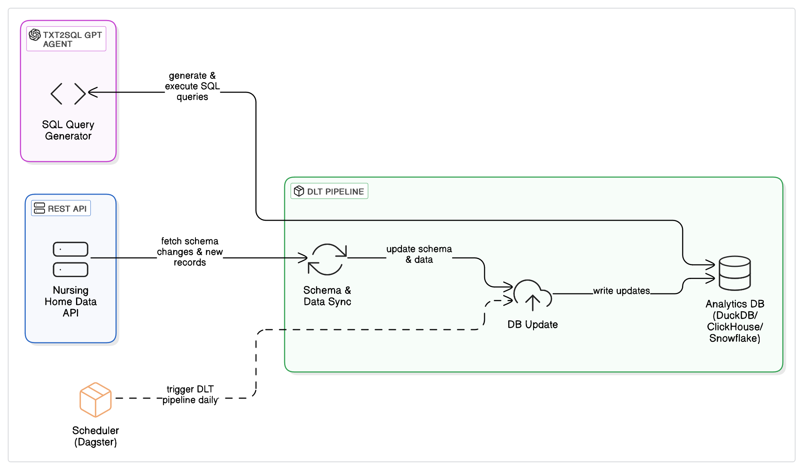

# 🧠 AI-Driven Nursing Home Analytics System

A modular system for generating, syncing, analyzing, and visualizing synthetic nursing home data using REST APIs, DLT pipelines, LLM agents, and a Streamlit UI.




---

## 🧩 Components

1. **📡 `rest-api-server`**  
   - Mock REST API serving synthetic nursing home data.  
   - Data includes hidden correlations for downstream discovery via TEXT2SQL + AutoML.
   - Data is idempotent.

2. **🔄 `dlt-data-sync`**  
   - DLT pipeline syncing data + schema changes to analytics DB (DuckDB).  
   - Tracks sync time + schema snapshots for efficient delta loading. 

3. **🧠 `llm-agents-lib`**  
   - **TXT2SQL Agent**  
     - Converts user prompts → SQL queries.  
     - Auto-corrects invalid SQL. 
     - Uses the db schemas for query generation.  
   - **📊 Plot Builder Agent**  
     - Takes SQL + prompt → returns Plotly visualizations.

4. **🖥️ `streamlit-app`**  
   - Streamlit UI to interact with agents.  
   - Displays query history.
   - Streams the agent reasoning / steps.

---

## ⚙️ Runtime Instructions

Ensure `uv` is installed.


```bash
# In the root directory, create a .env file
touch .env

# Add GOOGLE_API_KEY env variable (replace YOUR_API_KEY with your actual key)
echo "GOOGLE_API_KEY=YOUR_API_KEY" >> .env

# Add the DUCKDB_FILE_NAME env variable (replace path to output duckdb file of dlt pipeline_name)
echo "DUCKDB_FILE_NAME=.../rest_api_nursing_home.duckdb" >> .env

# Start REST API
cd rest-api-server
uv sync --frozen
uv run uvicorn main:app

# In a new terminal: Run dlt sync
cd dlt-data-sync
uv sync --frozen
uv run rest_api_pipeline.py

# after dlt sync completion: Launch Streamlit UI
cd streamlit-app
uv sync --frozen
uv run streamlit run main.py
```

---

## 🔮 Future Work

- Add ML Agent for real-time forecasting & clustering.  
- Agent will generate Python code using `scipy`, `pytorch`, etc.  
- Long-running tasks will be offloaded to a job server for async processing.
